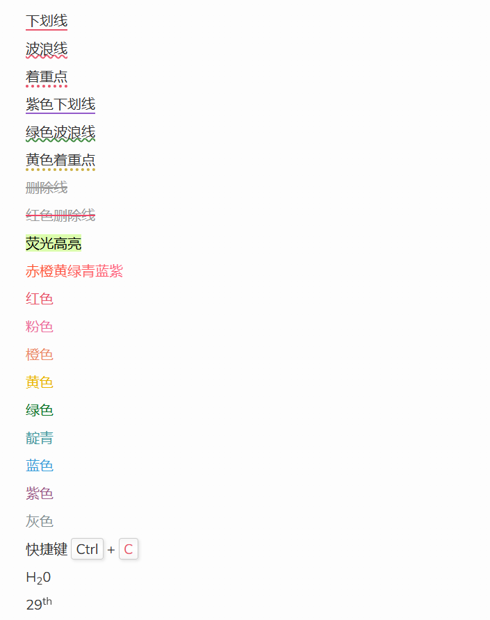

# links 链接块

本功能参考 NexT，基于 Hexo Tag 功能，用来建立友链或其他网址链接功能。

文章中的使用格式：

使用 links 标签块，包围 yml 语法书写的内容，字段包括：
| 配置项 | 配置内容 | 是否必填 | 备注 |
|:---:|:---:|:---:|:---:|
| site	|站点名称	|必填 | |
|owner	|管理员名字	|可选 |默认为 site 的值 |
|url	|站点链接	|必填 | |
|desc	|站点描述	|可选 | 默认为 url 的值 |
|image	|站点图片	|可选 |默认为 images/404.png |
|color	|方块颜色	|可选 |默认为 #666 |

```md

- site: #站点名称
  owner: #管理员名字
  url: #站点网址
  desc: #简短描述
  image: #一张图片
  color: #颜色代码

```

以上标签块里的内容，还可以保存到一个 yml 文件中，然后使用 linksfile 标签。
其中， path 位于 `<root>/source` 目录下。

```md

```

# code 代码块

基本格式：`[language] [title] [url] [link text] [mark] [command]`

选项|描述|默认值
--|--|--
language| - 支持的语言[戳此](https://prismjs.com/#supported-languages)|null \
| | - 如果不需要代码高亮，但希望显示代码块样式，则设为`raw` | \
| | - 留空或设为`info`，将不显示代码高亮和代码块样式 | |
title|代码块的标题文字|null
url|代码块标题右侧显示的链接|null
link text|上述链接显示的标题|link
mark|行高亮显示，格式为`mark:行号,行号开始-行号结束,其他行号`。| null \
| |例如`mark:1,4-7,10`，将高亮显示第1、4、5、6、7、10行| |
command|命令行提示符，格式为`command:("提示内容":行号,行号||"提示内容":行号开始-行号结束)`| null \
| |例如`command:("[root@localhost] $":1,9-10||"[admin@remotehost] #":4-6)` | |

# quiz 练习题与答案
## 概述
这个功能是用来显示练习题的。
需要在Front Matter中添加`quiz: true`，以正确显示题型标签。

```md 几个例子
---
title: 练习题与答案
quiz: true
---

1. 编译时多态主要指运算符重载与函数重载，而运行时多态主要指虚函数。 {.quiz .true}

2. 有基类`SHAPE`，派生类`CIRCLE`，声明如下变量：  {.quiz .multi}
    ```cpp
    SHAPE shape1,*p1;
    CIRCLE circle1,*q1;
    ```
    下列哪些项是“派生类对象替换基类对象”。
    - `p1=&circle1;` {.correct}
    - `q1=&shape1;`
    - `shape1=circle1;` {.correct}
    - `circle1=shape1;`
{.options}
    > - :heavy_check_mark: 令基类对象的指针指向派生类对象
    > - :x: 派生类指针指向基类的引用
    > - :heavy_check_mark: 派生类对象给基类对象赋值
    > - :x: 基类对象给派生类对象赋值
    > {.options}

3. 下列叙述正确的是 []{.gap} 。 {.quiz}
    - 虚函数只能定义成无参函数
    - 虚函数不能有返回值
    - 能定义虚构造函数
    - A、B、C都不对 {.correct}
{.options}

10. 如果定义`int e=8; double f=6.4, g=8.9;`，则表达式 `f+int(e/3*int(f+g)/2)%4` 的值为 [9.4]{.gap}。 {.quiz .fill}
    > 注意运算顺序和数据类型
    > [8.4]{.mistake}
```

## 使用说明
本功能基于`markdown-it-bracketed-spans`和`markdown-it-attrs`

标签|含义
:--:|:--:
`{.quiz}` | 选择题
`{.quiz .multi}` | 多选题
`{.quiz .true}` | 正确的判断题
`{.quiz .false}` | 错误的判断题
`{.quiz .fill}` | 填空题
`[]{.gap}` | 空白下划线
`[答案内容]{.gap}` | 答案内容带下划线
`{.options}` | ABCDE选项
`{.correct}` | 选择题的正确选项
`>` | 答案解析
`[8.4]{.mistake}` | 错题备注

# effects 文字特效

本功能基于`markdown-it-ins`、 `markdown-it-bracketed-spans`和`markdown-it-attrs`

> 本主题风格颜色通用样式：default、primary、success、info、warning、danger

```md
++下划线++
++波浪线++{.wavy}
++着重点++{.dot}
++紫色下划线++{.primary}
++绿色波浪线++{.wavy .success}
++黄色着重点++{.dot .warning}
~~删除线~~
~~红色删除线~~{.danger}
==荧光高亮==
[赤橙黄绿青蓝紫]{.rainbow}
[红色]{.red}
[粉色]{.pink}
[橙色]{.orange}
[黄色]{.yellow}
[绿色]{.green}
[靛青]{.aqua}
[蓝色]{.blue}
[紫色]{.purple}
[灰色]{.grey}
快捷键 [Ctrl]{.kbd} + [C]{.kbd .red}
H~2~0
29^th^
```



# spoiler 隐藏文字

本功能基于`markdown-it-spoiler`和`markdown-it-attrs`

```md
!!黑幕黑幕黑幕黑幕黑幕黑幕!! ： 鼠标滑过显示内容
!!模糊模糊模糊模糊模糊模糊!!{.bulr} ： 选中文字显示内容
```

# label 标签块

本功能基于`markdown-it-bracketed-spans`和`markdown-it-attrs`
有以下颜色可选

```md
[default]{.label}
[primary]{.label .primary}
[info]{.label .info}
[:heavy_check_mark:success]{.label .success}
[warning]{.label .warning}
[:broken_heart:danger]{.label .danger}
```

